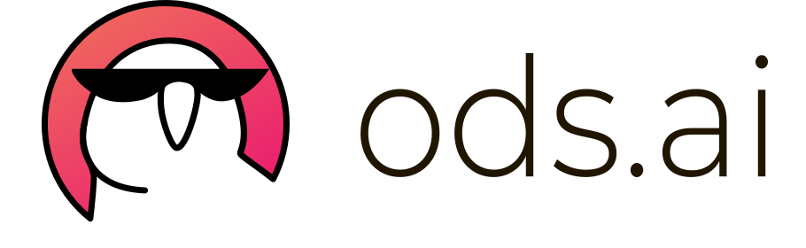

<h1 align="left">Hi, I'm George! Welcome to my page ☺️</h1>

###

###

<h3 align="left">👩‍💻 About me</h3>

###

I'm a newbie data scientist and on my third year at the technical university called «VGLTU» in Russia, Voronezh, studying «Information Systems and Technology» specialization. I finished the "Data Science Specialist" course from Yandex and am now taking "Mathematics for Data Analysis" course. I know Python really well and have used libraries like Pandas, Numpy, Matplotlib and Scikit-learn. I also know SQL, as I learned it from online courses and my university. I have some experience with C++ too. In addition to the projects made for the DS course, which you can see in my profile, I've built a few Telegram bots and worked on a project scraping russian patent documents to create a database using their information to train a model.

###

<h3 align="left">⭐ My achievements</h3>

-  **98/100 points on the Unified Government Exam in Computer Science,**

as well as 86 in specialized mathematics exam and 96 in Russian exam, for a total of 280 points out of 300;

- **Government scholarship at the University:**

I was published with articles about AI and similar topics in scientific journals.

###

<h3 align="left">🧠 Skills</h3>

###

  
  
  
  
  
  
  
  
  
  
  
  

###

<h3 align="left">🛠 Instruments</h3>

###

  
  
  
  
  
  
  
  
  
  
  
  

###

<h3 align="left">📕 Some ML articles </h3>

- [Fundamentals of linear regression](https://1drv.ms/w/c/480492ce6d44c9a7/EQA2X_-46zNJvW6sZkZnhoIBBZNwnjuMjZPWWZQu0arF0Q?e=IH8tBs)
- [Regularization in ML](https://1drv.ms/w/c/480492ce6d44c9a7/EW4-2dO6a4ROkN_Df2VFlsYBRz1GaVcSEzXv6SXRo83_IQ?e=LikNIC)

### 💻 Additional education

| Course                                                          | Date              | Docs |
| ----------------------------------------------------------------| :---------------: | :--: |
| [practicum.yandex/DS specialist](https://practicum.yandex.ru/data-scientist)                      | 12/2022 - 07/2023 | |
| [practicum.yandex/Mathematics for DA](https://practicum.yandex.ru/math-for-da-ds/)                 | 07/2025 - xx/2025 | — |

### 🗣 Languages

| Flag | Level             |
| :--: | :---------------: |
| | **C2** |
| | **B1** |
